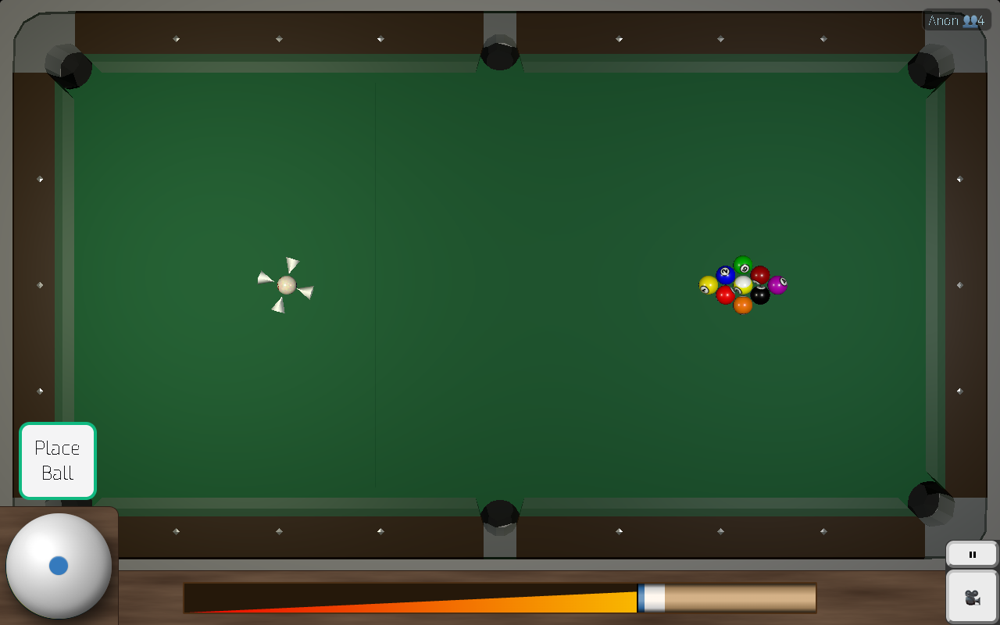

# green-felt

A **fork** of [tailuge/billiards](https://github.com/tailuge/billiards), an open-source project bringing unsophisticated billiards physics written in Typescript to the browser. Playable locally in any modern browser with WebGL support.



## Run locally

```shell
nvm use v24.11.0
corepack enable
yarn install
yarn serve
```

Then open <http://localhost:8080/> to play.

Features: 9-ball, 8-ball, snooker, three-cushion billiards, practice mode, and bot opponents (ClawBreak, TheFarJaw, BankShot, Drifter). 

## Features

* Backspin, sidespin and cushion bounces well modeled.
* Presentation using WebGL in any modern browser on mobile, linux, mac or windows.
* Record and playback breaks.
* Nine ball, eight ball, snooker and three cushion billiards rules.
* Bot opponents with multiple AI strategies.
* Runs on and was developed mostly on a potato e.g. Raspberry pi 4.

## Fork changes

Modifiche apportate rispetto al progetto originale [tailuge/billiards](https://github.com/tailuge/billiards):

* **Physics improvements** — cushion restitution clamp, Mathavan fallback per collisioni mancanti, refactor `throwFactor` in costanti configurabili.
* **Visual upgrades** — increased ball polygon detail for smoother spheres, uniform white cue ball.
* **Help overlay** — always-visible overlay with unobtrusive help button, larger fonts, mobile-friendly horizontal row layout.
* **README & branding** — renamed to green-felt, screenshot updated, focus on local/offline setup.
* **Development docs** — `AGENTS.md` with repo guidelines for AI-assisted tooling.

## Reference material

* Papers on ball mechanics [Han 2005](https://billiards.colostate.edu/physics_articles/Han_paper.pdf)
with important corrections by [Kiefl](https://ekiefl.github.io/2020/04/24/pooltool-theory/#3-han-2005").
* [cushions](https://billiards.colostate.edu/physics_articles/Mathavan_IMechE_2010.pdf), [max spin](https://billiards.colostate.edu/technical_proofs/new/TP_B-17.pdf),
simulation and constants [1](https://savoirs.usherbrooke.ca/bitstream/handle/11143/6598/MR91690.pdf?sequence=1)
[2](http://citeseerx.ist.psu.edu/viewdoc/download?doi=10.1.1.89.4627&rep=rep1&type=pdf)
[3](https://www.researchgate.net/publication/228634093_Bounce_of_a_spinning_ball_near_normal_incidence)
[4](https://billiards.colostate.edu/technical_proofs/new/TP_B-6.pdf)
[5](https://billiards.colostate.edu/faq/physics/physical-properties/)
* 3D graphics uses [three.js](https://threejs.org/docs/index.html#api/math/Vector3)
* Inline [LaTeX](https://www.codecogs.com/eqnedit.php?latex=\dot{a}) editor
for equations in README.md

### Key equations

Based on [Han 2005](https://billiards.colostate.edu/physics_articles/Han_paper.pdf) paper

#### surface velocity

$$\vec{v}_a = \vec{v} + (\vec{up} \times R\vec{\omega})$$

#### sliding motion

$$\dot{v} = -\mu g \frac{\vec{v}_a}{|\vec{v}_a|}$$

$$\dot{\omega} = -\frac{5}{2}\frac{\mu g}{R} \frac{\vec{v}_a}{|\vec{v}_a|}$$

$$\dot{\omega}_z = -\frac{5}{2}\frac{M_z}{mR^2} \text{sgn}(\omega_z)$$

#### rolling motion

$$\dot{v} = -\frac{5}{7}\frac{M_{xy}}{mR} \frac{\vec{up} \times \vec{\omega}}{|\vec{\omega}|}$$

$$\dot{\omega} = -\frac{5}{7}\frac{M_{xy}}{mR^2} \frac{\vec{\omega}}{|\vec{\omega}|}$$

where

$M_{xy} = \frac{7}{5\sqrt{2}} R \mu m g$ , $M_z = \frac{2}{3} \mu m g \rho$

#### collisions

Based on paper by [Alciatore](https://billiards.colostate.edu/technical_proofs/new/TP_A-14.pdf) incorporating throw effect due to the small amount of friction between balls. See [code](./src/model/physics/collisionthrow.ts).


For ball $a$:

$$\vec{v}_a \leftarrow \vec{v}_a + \frac{J_{\text{normal}}}{m}\hat{n} + \frac{J_{\text{tangential}}}{m}\hat{t}$$

$$\vec{\omega}_a \leftarrow \vec{\omega}_a + \frac{1}{I} (\vec{r}_a \times \vec{J}_{\text{tangential}})$$

For ball $b$:

$$\vec{v}_b \leftarrow \vec{v}_b - \frac{J_{\text{normal}}}{m}\hat{n} - \frac{J_{\text{tangential}}}{m}\hat{t}$$


$$\vec{\omega}_b \leftarrow \vec{\omega}_b + \frac{1}{I} (\vec{r}_b \times \vec{J}_{\text{tangential}})$$


Where:

The relative velocity at the point of contact is computed as:

$$\vec{v}_{\text{rel}} = (\vec{v}_a - \vec{v}_b) + \vec{r}_a \times \vec{\omega}_a - \vec{r}_b \times \vec{\omega}_b$$

$\vec{v}_{\text{slip}} = \vec{v}_{\text{rel}} - (\vec{v}_{\text{rel}} \cdot \hat{n}) \hat{n}$

$\vec{r}_a = -R \cdot \hat{n}$ and $\vec{r}_b = R \cdot \hat{n}$

$J_{\text{normal}} = \frac{-(1 + e)v_{\text{rel,normal}}}{(2/m)}$

$J_{\text{tangential}} = \min\left( \frac{\mu J_{\text{normal}}}{v_{\text{rel}}}, \frac{1}{7} \right)(-v_{\text{rel,tangential}})$

$\hat{n}$: normal unit vector along the line of centers.

$\hat{t}$: tangential unit vector perpendicular to $\hat{n}$.

#### cushion bounce

This is based on a paper by [Mathavan](https://billiards.colostate.edu/physics_articles/Mathavan_IMechE_2010.pdf).

Slip velocity at cushion contact point I

$$
ẋ_I = \dot{v_x} + \dot{\omega_y} R \sin \theta - \dot{\omega_z} R \cos \theta \qquad
ẏ'_I = -\dot{v_y} \sin \theta + \dot{\omega_x} R
$$

$$
\phi = \arctan\left(\frac{ẏ'_I}{ẋ_I}\right) \qquad
s = \sqrt{(ẋ_I)^2 + (ẏ'_I)^2}
$$

Slip velocity at table contact point C

$$
ẋ_C = \dot{v_x} - \dot{\omega_y} R \qquad
ẏ_C = \dot{v_y} + \dot{\omega_x} R
$$

$$
\phi' = \arctan\left(\frac{ẏ_C}{ẋ_C}\right) \qquad
s' = \sqrt{(ẋ_C)^2 + (ẏ_C)^2}
$$

Numerical solutions for the centroid velocity of the ball during compression and resititution phases.

$$
(\dot{v_x})_{n+1} - (\dot{v_x})_n = - \frac{1}{M} \left[\mu_w \cos(\phi) + \mu_s \cos(\phi') \cdot (\sin \theta + \mu_w \sin(\phi) \cos \theta)\right] \Delta P_I
$$

$$
(\dot{v_y})_{n+1} - (\dot{v_y})_n  = - \frac{1}{M} \left[ \cos \theta - \mu_w \sin \theta \sin \phi + \mu_s \sin \phi' \cdot \left( \sin \theta + \mu_w \sin \phi \cos \theta \right) \right] \Delta P_I
$$

Numerical solutions for angular velocity of ball

$$
(\dot{\omega_x})_{n+1}−(\dot{\omega_x})_n = -\frac{5}{2MR}[\mu_w \sin(\phi) + \mu_s \sin(\phi') \times (\sin(\theta) + \mu_w \sin(\phi)\cos(\theta))]\Delta P_I
$$


$$
(\dot{\omega_y})_{n+1}−(\dot{\omega_y})_n = -\frac{5}{2MR}[\mu_w \cos(\phi)\sin(\theta) - \mu_s \cos(\phi') \times (\sin(\theta) + \mu_w \sin(\phi)\cos(\theta))]\Delta P_I
$$


$$
(\dot{\omega_z})_{n+1}−(\dot{\omega_z})_n = \frac{5}{2MR}(\mu_w \cos(\phi)\cos(\theta))\Delta P_I
$$

$\theta$ is a constant of the angle of cushion contact above ball centre with $\sin(\theta) = 2/5$. $\mu_s$ is the coefficient of sliding friction  between the ball and table surface. $\mu_w$ is the coefficient of sliding friction  between the ball and the cushion. 

Work done by the normal force at contact point $I$ along the $Z'$-axis which is aligned from the ball centre to I

$$
W_{Z'}^I(P_I^{(n+1)}) = W_{Z'}^I(P_I^{(n)}) + \frac{\Delta P_I}{2} \left( z'_I(P_I^{(n+1)}) + z'_I(P_I^{(n)}) \right)
$$

The ball is assumed to be bouncing in the +y cushion. Compression phase iterates until 

$$\dot{v}_y \le 0$$

For the restitution phase the iteration continues until the work done is

$$W_{Z'}^I \ge e_e^2 W_{\text{compression}}$$

Some of the Mathavan equations not supplied by the paper were inferred to bridge gaps for a complete numerical solution.

## Useful commands

### Build

```shell
yarn build
```

### Test

```shell
yarn test
yarn coverage
```

### Lint

```shell
yarn lint
yarn prettify
```

## Controls

Use mouse, touch screen or keyboard:

<kbd style="border: 1px solid #aaa; border-radius: 0.2em; padding: 0.1em 0.3em; font-size: 0.85em;">⇦</kbd>
<kbd style="border: 1px solid #aaa; border-radius: 0.2em; padding: 0.1em 0.3em; font-size: 0.85em;">⇨</kbd> Aim

<kbd style="border: 1px solid #aaa; border-radius: 0.2em; padding: 0.1em 0.3em; font-size: 0.85em;">Control</kbd>
<kbd style="border: 1px solid #aaa; border-radius: 0.2em; padding: 0.1em 0.3em; font-size: 0.85em;">⇦</kbd>
<kbd style="border: 1px solid #aaa; border-radius: 0.2em; padding: 0.1em 0.3em; font-size: 0.85em;">⇨</kbd> Fine aim

<kbd style="border: 1px solid #aaa; border-radius: 0.2em; padding: 0.1em 0.3em; font-size: 0.85em;">⇧</kbd>
<kbd style="border: 1px solid #aaa; border-radius: 0.2em; padding: 0.1em 0.3em; font-size: 0.85em;">⇩</kbd> Topspin and backspin

<kbd style="border: 1px solid #aaa; border-radius: 0.2em; padding: 0.1em 0.3em; font-size: 0.85em;">Shift</kbd>
<kbd style="border: 1px solid #aaa; border-radius: 0.2em; padding: 0.1em 0.3em; font-size: 0.85em;">⇦</kbd>
<kbd style="border: 1px solid #aaa; border-radius: 0.2em; padding: 0.1em 0.3em; font-size: 0.85em;">⇨</kbd> Side spin

<kbd style="border: 1px solid #aaa; border-radius: 0.2em; padding: 0.1em 0.3em; font-size: 0.85em;">Space</kbd> Hit - hold for more power


## Licence 

This project is open source and licensed under the GNU General Public License - see the [LICENSE](LICENSE) file for details. Contributions welcome.


